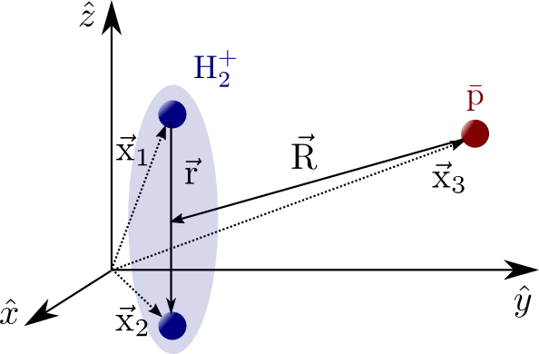

PES Scatter
===========

3-body classical scattering code on a quantum PES.



Please clone the repo:

    git clone git@github.com:TomMelt/PES3.git

To install on local machine:

    pip install -U -e .

Prerequisites
* ```numpy```
* ```random```
* ```scipy```

TODO:
====
* Take a look at the classical action (zeroth order phase)
    * if it varies slowly it indicates classical nature
    * if it varies rapidly calculate the phase and interferance for quantum number n
    * classical action of whole system or of pbar?
* still need to write tests for:
    * ```classify.py```
    * ```initialize.py```
    * ```numeric.py```
    * ```propagation.py```
* change transform.getParticleCoords() to be in lab frame coordinates
* Check how starting position affects the scattering velocities/ distro of nq
    * Could calculate the integral of energy gained by moving through 1/r pot.
* plot 3d surface of PES
* draw diagram of coords

NOTE:
=====
* initially program was also built in spherical coords
    - this does not work well with RK4 prop because angles can be arbitrarily large and;
    - there are singularities in the equations of motion (1/sin^2(phi)) etc.
* Error in the Hamiltonian appears to come from close encounter of all three particles
    - tried using just short range potential < 5 a.u. but this was not successful
* E.E.Nikitin Jost W. (Ed.), Phys. chem., 6a, Academic Press, New York (1974) ch. 4
    - "one of the necessary conditions for the proper description in terms of a classical traj. is that changes in the De Broglie wavelength of the appropriate vars. be small over the scale determined by the spatial variation of the wavefunction"
    - "epsilon*b*b = l_c^2/2Mu" 
